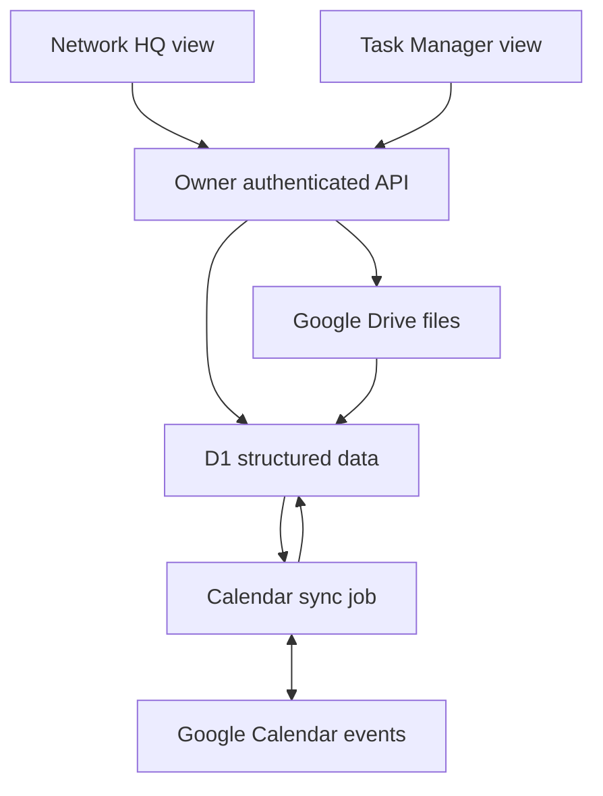

# Phase 2 developer handoff

Status: development code and isolated tests only. Read the [dated checkpoint](PHASE-2-DEVELOPMENT-CHECKPOINT-2026-10-08.md) before integrating anything.

## Reproduce

Check out phase2/shared-work-editing from amadison6/creative-network-demo. Node 24 provides Web Request/Response, crypto and node:sqlite. No npm install is required for the isolated test harness.

```sh
node shared-backend/tests/phase2.mjs
node shared-backend/tests/bridge-extension.mjs
```

All databases are in-memory, fixture data is synthetic, no remote DB/Calendar credentials are used. The JSON results file records the last run but rerunning the command is authoritative.

Worker entry: shared-backend/worker/src/phase2-worker.mjs. It is separate from the deployed Phase 1 worker and has no activation endpoint. A Cloudflare-compatible bundle was produced using Wrangler --dry-run; to reproduce with the installed toolchain:

```sh
wrangler deploy shared-backend/worker/src/phase2-worker.mjs --dry-run --outdir /tmp/network-hq-work-development --name network-hq-work-development --compatibility-date 2026-09-15
```

Do not remove --dry-run or add production bindings for this development check.

## File map

| File | Responsibility |
| --- | --- |
| schema/002_work_operations.sql | Additive operation receipts, event metadata, cursor and outbox tables; not applied live |
| worker/src/work-operations.mjs | Validation, canonical edits, global revision serialization, atomic audit history |
| worker/src/calendar-sync.mjs | Link/edit/pull/flush/conflict resolution, direct HTTP transport |
| worker/src/calendar-cycle.mjs | Server job orchestration; unbound, no schedule registered |
| worker/src/google-bridge-provider.mjs | Existing bridge extension contract |
| google-calendar-bridge-extension.gs | Uninstalled Apps Script helper, preserves existing dispatcher/auth/actions |
| work-view-client.mjs | Two development adapters using a server-authenticated transport |
| export-work-checkpoint.mjs | Read-only consistent export and integrity verification |
| tests/phase2.mjs | End-to-end isolated Worker/API/SQLite/provider/recovery tests |

Paths in this table are relative to shared-backend/.

## Request contract

Machine requests require server-only WORK_API_TOKEN. Browser clients must call an owner-authenticated same-origin proxy; that proxy forwards the token internally. Never put the token or GOOGLE_SHEETS_BRIDGE_URL / NETWORK_BRIDGE_SECRET values in browser JavaScript.

Every mutation has operationId (unique retry key), sourceApp, action, expectedVersion. Updates also require immutable entityId and expectedRevision. sourceApp is an audit label, not an authorization grant. Allowed labels: network-hq, task-manager, google-calendar, recovery. A proxy must choose the label server-side rather than trusting a browser to impersonate another source.

GET /v2/work/state returns canonical DB row fields, version and event metadata. It requires the same isolated-mode gate as mutations.

POST /v2/work/operations accepts hub.create/update, project.create/update, task.create/update. patch uses snake_case DB field names. IDs, revisions, source aliases and migration identities cannot be patched. links can replace people (canonical profile IDs), dependsOn (canonical task IDs), and resource references. Archiving uses task status Archived; no hard task deletion operation is provided.

Example using synthetic IDs:

```json
{
  "operationId": "owner_edit_unique_001",
  "sourceApp": "task-manager",
  "action": "task.update",
  "expectedVersion": 12,
  "entityId": "task_fixture",
  "expectedRevision": 3,
  "patch": {"status": "Done"}
}
```

POST /v2/work/events/edit changes an explicitly linked event's summary, description, location, start or end, with event entityId, expectedRevision, expectedVersion and patch. It queues an outbound patch; a task completion does not automatically cancel/complete an event.

POST /v2/work/events/resolve requires choice local or remote, expectedRevision and reviewedEtag matching the conflict currently shown. A cancelled remote event cannot be restored through the local choice. Recurrence conflicts stay blocked pending a separate series design.

POST /v2/work/calendar/link requires calendarId, externalEventId and optional taskId/projectId; it reads and links an existing non-recurring event. pull takes calendarId; flush takes the local event entityId. Provider operations run server-side. Live event creation, unlinking, recurring series edits and automatic task-date mapping are not implemented.

Errors: 400 invalid input/relationships; 401 missing machine authentication; 404 missing entity/route; 409 stale state/entity/conflict, reload before reviewing/retrying; 412 provider version changed, pull and review; 423 mode/checkpoint gate; 413 oversized request; provider availability errors preserve pending intent. Do not blindly replay a rejected edit against a new revision.

## Concurrency and audit decisions

A unique work_operation_requests.sequence serializes each transaction against expectedVersion. This is deliberately conservative for the current small personal dataset: concurrent independent edits may require a reload, but graph invariants and before/after history cannot silently race. The receipt, entity/link writes and history share one DB.batch transaction. Retry keys must represent the identical request; reuse with different content is rejected. Audit actor identity must come from the future authenticated proxy; the current source label alone does not establish who made the request.

All writes to these Phase 2 entities must use this serialization path; a new direct SQL writer would bypass its concurrency guarantee. Scaling the snapshot/validation model and multi-user permission model requires explicit follow-up work.

## Intended structure — not activated



The Drive-to-D1 arrow means references/metadata, never file bytes. In production today, Task Manager still calls its Blob API; the diagram describes the intended shared structure, not deployed Phase 2 behavior.

## Sync decisions

- Calendar owns actual events; D1 stores a structured, revisioned mirror and linkage. The two views read the same event metadata.
- Persist a cursor only after every page and all local changes commit. A 410 starts a fresh snapshot; retain local tasks/history/pending intents and mark absent links missing for review.
- Compare base/local/remote fields. Independent edits merge; collisions preserve both versions and block outgoing writes until an owner reviews the current conflict.
- App changes and outbox intent commit together. Outgoing patches contain only supported changed fields, use If-Match, and preserve attendees and other provider-owned fields.
- A crash after remote success but before local acknowledgment is safe to retry: compare the remote echo to desired state before issuing another patch.
- No blanket export of every task to Calendar. Only explicit event links participate. No implicit task completion, file migration or unrelated-event import occurs.
- Scheduler and real authorization/scopes are not connected; isolated success cannot establish production sync latency or permissions.

Primary specifications consulted: Google [incremental sync](https://developers.google.com/workspace/calendar/api/guides/sync), [resource versions](https://developers.google.com/workspace/calendar/api/guides/version-resources), [events.list](https://developers.google.com/workspace/calendar/api/v3/reference/events/list), and [events.patch](https://developers.google.com/workspace/calendar/api/v3/reference/events/patch). Implementation choices above are project decisions, not verbatim specification requirements.

## Next safe integration task

Confirm the exact deployed Apps Script source/version and OAuth manifest through owner-authorized access. The saved Library reference Creative_Network_Google_Drive_Connector.gs v2 (modified 2026-10-03) has been read: requireSecret_(payload.secret) precedes dispatch, Calendar handlers use CalendarApp, and the original six action handlers are preserved by the prepared google-calendar-bridge-dispatch.patch. The private saved source contains an installation secret; do not copy the full source to GitHub. The public patch/tests contain no private source configuration or secret values.

Apply the small dispatcher patch only after matching the deployed source, and add the extension helper alongside it. The helper requires ownerAuthorized=true from the existing secret check plus server-side WORK_CALENDAR_TEST_ENABLED and WORK_CALENDAR_TEST_ID Script Properties. Verify Google scopes and the owner-granted test calendar before writing. This extension alone does not activate Work or authorize production Calendar changes.

Legacy CalendarApp event.getId() returns an iCalendar UID, whereas REST events.id is a different identifier. The new provider expects the REST ID. Preserve and explicitly match legacy event aliases before linking; never derive identity by stripping a suffix or by title/time alone. Ambiguous or recurring matches need review. This legacy-ID reconciliation is a remaining integration gate.

Open the existing Sites source project appgprj_6ab0c1e933608191b1e667e5e9c4147a, verify the latest live version against source 5620cd09d303417d64042847ddf47a02d1a37b2e, and preserve DB/BUCKET declarations. Use the current owner request check in app/lib/ledger.ts for any browser proxy. Preserve /api/work Phase 1 routes and legacy API consumers. For Task Manager, retain /api/state Blob behavior until separately approved cutover; develop behind a verified owner-authenticated test boundary.

Do not try to enable this isolated development Worker against the current production DB: its migration-batch guard intentionally refuses it. Prepare an owner-reviewable test-data boundary within the existing service before any remote write, with checkpoint preservation and no second permanent D1. Obtain live test evidence before replacing this development-only gate with any approved production mode.

## Access, secrets and recovery

Owner grants access to GitHub, the existing Sites source/env management, Vercel project and the existing Google bridge. Sites hides physical Cloudflare resource identifiers; DB is the accepted logical identity. WORK_API_TOKEN, NETWORK_BRIDGE_SECRET, Google tokens and any test allowlist configuration are server-side only. Use existing provisioning screens; do not publish values or private exports in this repo.

Before restoring earlier production behavior, freeze writes/sync jobs and preserve newer Blob state, D1 rows, audit history, receipts, outbox/cursors, and provider events. Validate the checksummed export and keep original backups. Production recovery must reconcile newer writes; this code offers no destructive restore endpoint. The successful restore test used a separate in-memory DB only.
